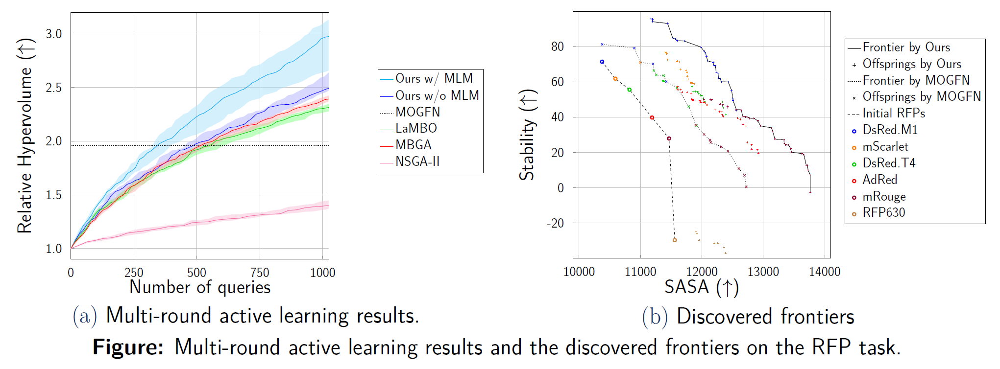

# Greedy Policy for MOCO
Official PyTorch implementation of "Training Greedy Policy for Proposal Batch Selection in Expensive Multi-Objective Combinatorial Optimization", published at **ICML'24**. This code is built on top of [LaMBO repo](https://github.com/samuelstanton/lambo) and [MOGFL repo](https://github.com/MJ10/mo_gfn/tree/4993a6107a0632ac9baf2b930c9399306b530e37)

[**Paper**](https://arxiv.org/abs/2406.14876) 


> **Abstract** *Active learning is increasingly adopted for expensive multi-objective combinatorial optimization problems, but it involves a challenging subset selection problem, optimizing the batch acquisition score that quantifies the goodness of a batch for evaluation. Due to the excessively large search space of the subset selection problem, prior methods optimize the batch acquisition on the latent space, which has discrepancies with the actual space, or optimize individual acquisition scores without considering the dependencies among candidates in a batch instead of directly optimizing the batch acquisition. To manage the vast search space, a simple and effective approach is the greedy method, which decomposes the problem into smaller subproblems, yet it has difficulty in parallelization since each subproblem depends on the outcome from the previous ones. To this end, we introduce a novel greedy-style subset selection algorithm that optimizes batch acquisition directly on the combinatorial space by sequential greedy sampling from the greedy policy, specifically trained to address all greedy subproblems concurrently. Notably, our experiments on the red fluorescent proteins design task show that our proposed method achieves the baseline performance in 1.69x fewer queries, demonstrating its efficiency.*

## Installation
Requirements : Anaconda, cudatoolkit 11.3
1. Install conda environment 
* Run install scripts.
```bash
    source install.sh
```
Note. Ignore the version conflict related to protbuf.

2. (Optional) If you want to conduct single-round experiments on the DNA aptamers, please follow instructions in [NUPACK Docs](https://docs.nupack.org/) to install NUPACK library ver 4.0.1. You may login [this link](https://www.nupack.org/download/license) to agree NUPACK license.

3. (Optional) If you want to conduct multi-round experiments on the red fluorescent proteins (RFPs), please follow instructions in [LaMBO](https://github.com/samuelstanton/lambo/tree/main) to install [FoldX](https://foldxsuite.crg.eu/academic-license-info) executable and supporting assets.

## 1. Run Single-Round Experiments
### Arguments
* `task`: name of task [`regex_2`, `regex`, `regex_4`, `nupack_energy_pins_pairs`]
* `tokenizer`: name of tokenizer [`protein`, `aptamer`]
* `algorithm`: name of algorithm [`setrl`, `moreinforce`, `greedyrl`, `rand_hill`, `rand_sample`]
* `max_size`: `n`, the cardinality constraint for actual construction

* `train_steps`: `N_u = 4000`, the number of update steps
* `batch_size`: `N_e = 128`, the number of episodes per step
* `n_set_samples`: `N_t = 4`, the frequency of updating behavior 
* `train_max_size`: `n_train = 64`, the cardinality constraint for training
* `pi_lr` : `eta`, learning rate [`1e-4`, `1e-5`, `1e-6`]
* `random_action_prob`: random action prob [`0`, `0.05`]

### Commands
Here, we introduce the commands to reproduce our experimental results in Table 1 as follows.

To start, activate the installed environment for single-round experiments by run ```conda activate setbench```.
For easier understanding, we present commands for (4 Bigrams, `n=16`) case of Table 1.
   | Method | Hypervolume Indicator (4 Bigrams, `n=16`) |
   | :--- | :------: |
   | Ours       | **0.077** (0.000) |
   | PC-RL (TS) | 0.054 (0.003) |
   | PC-RL (WS) | 0.016 (0.005) | 
   | Greedy + RL| 0.062 (0.005) |
   | Greedy + HC| 0.014 (0.008) |
   | Greedy + RS| 0.000 (0.000) |

#### Ours
```bash
python run_scripts/run_single.py algorithm.state_save_path=$DIR2SAVE task=regex_4 tokenizer=protein algorithm=setrl algorithm.pi_lr=1e-4 algorithm.random_action_prob=0.0 algorithm.max_size=16 trial_id=$trial_id
```
#### Baselines
Preference-conditioned reinforcement learning (PC-RL) w/ Tchebycheff scalarization (TS)
```bash
python run_scripts/run_single.py algorithm.state_save_path=$DIR2SAVE task=regex_4 tokenizer=protein algorithm=moreinforce algorithm.reward_type=tchebycheff algorithm.pi_lr=1e-4 algorithm.random_action_prob=0.0 algorithm.max_size=16 algorithm.simplex_bins=20 trial_id=$trial_id
```
Preference-conditioned reinforcement learning (PC-RL) w/ weight scalarization (WS)
```bash
python run_scripts/run_single.py algorithm.state_save_path=$DIR2SAVE task=regex_4 tokenizer=protein algorithm=moreinforce algorithm.reward_type=convex algorithm.pi_lr=1e-5 algorithm.random_action_prob=0.0 algorithm.max_size=16 algorithm.simplex_bins=20 trial_id=$trial_id
```
Greedy + reinforcement learning (RL) 
```bash
python run_scripts/run_single.py algorithm.state_save_path=$DIR2SAVE task=regex_4 tokenizer=protein algorithm=greedyrl algorithm.pi_lr=1e-5 algorithm.random_action_prob=0.0 algorithm.max_size=16 trial_id=$trial_id
```
Greedy + hill climbing (HC)
```bash
python run_scripts/run_single.py algorithm.state_save_path=$DIR2SAVE task=regex_4 tokenizer=protein algorithm=rand_hill algorithm.max_size=16 trial_id=$trial_id
```
Greedy + random sampling (RS)
```bash
python run_scripts/run_single.py algorithm.state_save_path=$DIR2SAVE task=regex_4 tokenizer=protein algorithm=rand_sample algorithm.max_size=16 trial_id=$trial_id
```
After running commands above for ```$trial_id in [0,1,...,9]```, you may adopt the following example script to aggregate the results.
```bash
python agg_scripts/agg_single_example.py
```
If you use [slurm workload manager](https://slurm.schedmd.com/documentation.html), you may run ```sbatch run_scripts/run_single_example.sbatch``` to run commands above for 10 trials at once.


Note. For a fair comparison, we fix the number of queries to the deterministic surrogate model across all methods. We consider `(pi_lr, random_action_prob) in [1e-3, 1e-4, 1e-5] X [0.0, 0.05]` for hyperparameter tuning. Please refer to Appendix B.3 for the detailed experimental settings.

Note. For the faster runtime of `Ours`, you may set `n_set_samples` to a higher value. This may result in a lower performance.

Note. Since we can reuse a set-conditioned rl agent or a preference-conditioned rl agent to generate subsets with various cardinality, we can conduct experiments for multiple cardinalities at once for `Ours` and `PC-RL` methods. You may set `algorithm.max_size=-1` to conduct experiments for `n=4, 16, 64, 256` at once.

## 2. Run Multi-Round Experiments


Here, we introduce the commands to reproduce our experimental results in Figure 2, 3, and 4 as follows.

### Arguments
* `task`: name of task [`regex`, `proxy_rfp`]
* `tokenizer`: name of tokenizer [`protein`]
* `algorithm`: name of algorithm [`setrl`, `lambo`, `mb_genetic`, `mf_genetic`]
* `acquisition`: name of acquisition [`nehvi`, `ehvi`, `ucbhvi`]

* optimizer.use_mlm_logits: Set `True` for `Ours w/ MLM` [`True`, `False`] 

### Commands
To start, activate the installed environment by run ```conda activate setbench```.

#### Ours
Ours w/ MLM
```bash
python run_scripts/run_active_learning.py task=$task tokenizer=protein acquisition=nehvi optimizer=setrl optimizer.use_mlm_logits=True trial_id=$trial_id
```
Ours w/o MLM
```bash
python run_scripts/run_active_learning.py task=$task tokenizer=protein acquisition=nehvi optimizer=setrl optimizer.use_mlm_logits=False trial_id=$trial_id
```

#### Baselines
LaMBO
```bash
python run_scripts/run_active_learning.py task=$task tokenizer=protein acquisition=nehvi optimizer=lambo trial_id=$trial_id 
```

Model-based genetic algorithm (MBGA)
```bash
python run_scripts/run_active_learning.py task=$task tokenizer=protein acquisition=nehvi optimizer=mb_genetic optimizer/algorithm=soga trial_id=$trial_id
```

NSGA-II
```bash
python run_scripts/run_active_learning.py task=$task tokenizer=protein optimizer=mf_genetic optimizer/algorithm=nsga2 trial_id=$trial_id
```
We conducted each experiment for 10 trials.

## Machine Information
Below are the information about machine that authors used.
* OS: Ubuntu 22.04
* CUDA Driver Version: 530.30.02
* gcc: 11.4.0
* nvcc(CUDA): 12.1
* CPU: AMD EPYC 7402 24-Core Processor
* GPU: NVIDIA GeForce RTX 3090 GPU


## Citation

```
% Our paper
@inproceedings{lee24greedy,
      title={Training Greedy Policy for Proposal Batch Selection in Expensive Multi-Objective Combinatorial Optimization},
      author={Lee, Deokjae and Song, Hyun Oh and Cho, Kyunghyun},
      booktitle = {International Conference on Machine Learning (ICML)},
      year={2024}
}

% MOGFN
@inproceedings{jain2023multi,
  title={Multi-objective gflownets},
  author={Jain, Moksh and Raparthy, Sharath Chandra and Hern{\'a}ndez-Garc{\i}́a, Alex and Rector-Brooks, Jarrid and Bengio, Yoshua and Miret, Santiago and Bengio, Emmanuel},
  booktitle={International Conference on Machine Learning},
  pages={14631--14653},
  year={2023},
  organization={PMLR}
}

% LaMBO
@inproceedings{stanton2022accelerating,
  title={Accelerating bayesian optimization for biological sequence design with denoising autoencoders},
  author={Stanton, Samuel and Maddox, Wesley and Gruver, Nate and Maffettone, Phillip and Delaney, Emily and Greenside, Peyton and Wilson, Andrew Gordon},
  booktitle={International Conference on Machine Learning},
  pages={20459--20478},
  year={2022},
  organization={PMLR}
}
```